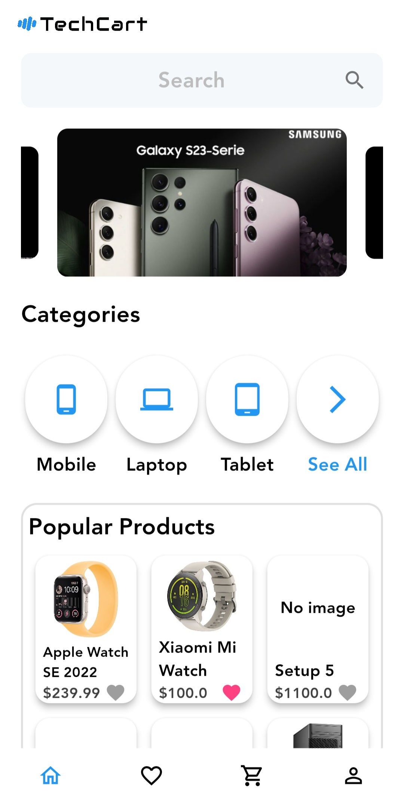
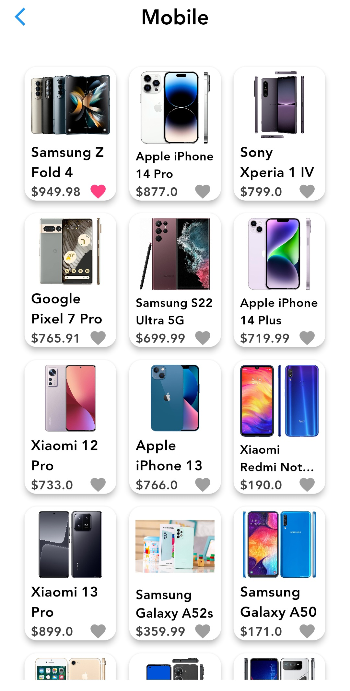
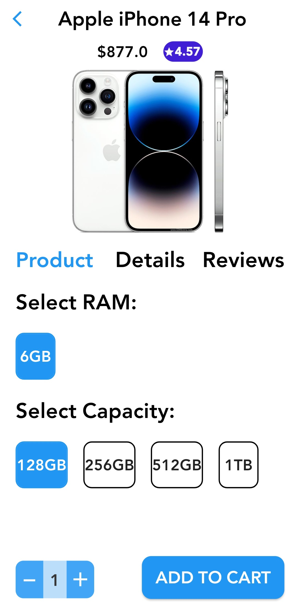
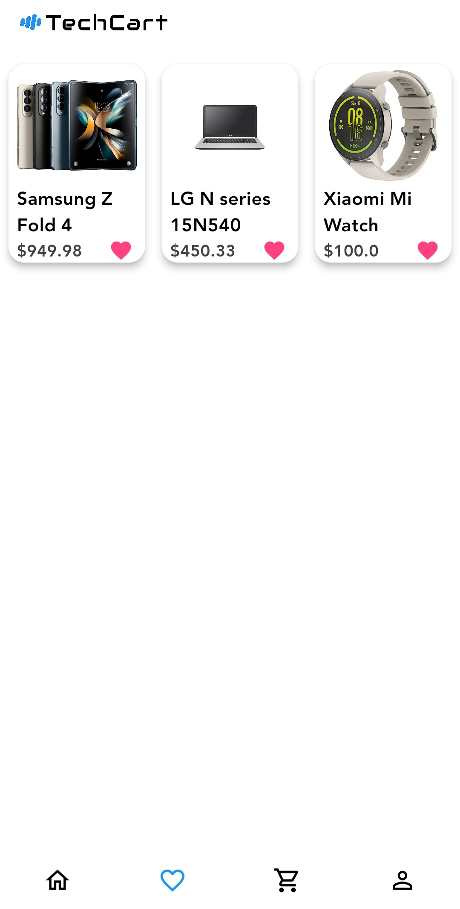
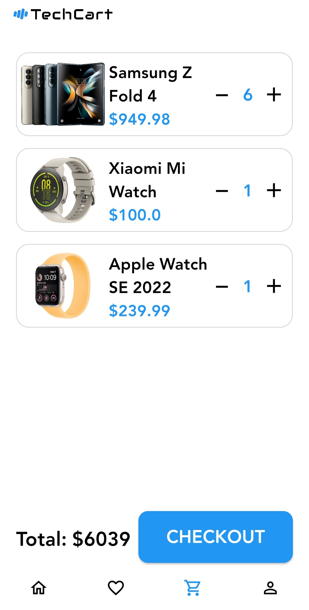
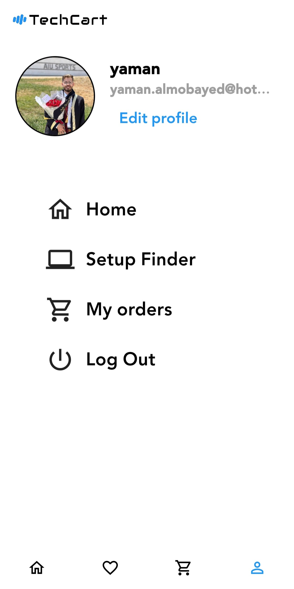
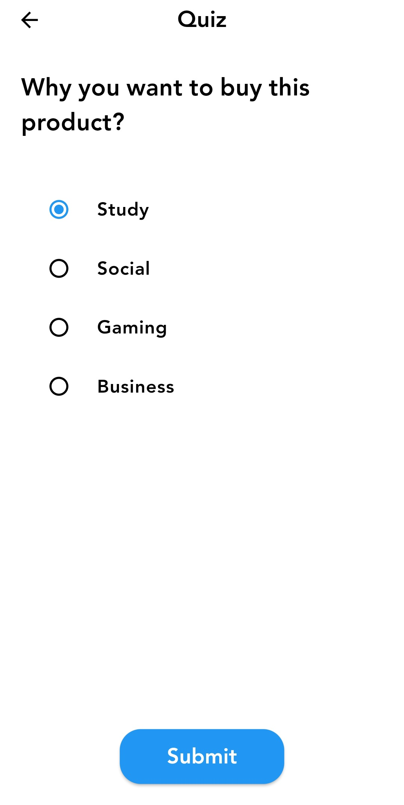
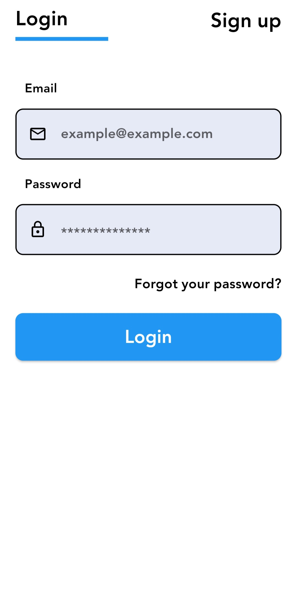

# Techcart

Techcart is a cutting-edge e-commerce app designed to redefine your online shopping journey, focusing on seamless functionality and a personalized experience. This showcase app is meticulously crafted to cater to tech enthusiasts, providing an extensive array of products, intuitive features, and a user-friendly interface.

## Features

- **Product Showcase by Categories:** Effortlessly explore a wide range of tech products conveniently organized by categories. Whether you're into gadgets, electronics, or accessories, Techcart ensures you find exactly what you're looking for with ease.

- **Smart Search Functionality:** Find your desired products in the blink of an eye with our powerful search feature. Techcart's intelligent search algorithm quickly narrows down results, saving you time and ensuring you discover the perfect tech items.

- **Personalized Recommendations:** Experience a curated shopping experience with personalized product recommendations tailored just for you. Techcart utilizes advanced algorithms to understand your preferences, ensuring that you always discover exciting new tech products.

- **Detailed Product Information:** Dive deep into product details to make informed decisions. Techcart provides comprehensive information, including specifications and ratings, empowering you to choose products that match your needs and preferences.

- **Favorites and Cart Management:** Keep track of your favorite products by adding them to your wishlist. Easily manage your shopping cart, review items, and proceed to checkout seamlessly for a hassle-free shopping experience.

- **Effortless Ordering Process:** Place your orders with just a few taps. Techcart ensures a smooth and secure checkout process, allowing you to complete your purchase efficiently.

- **User Authentication and Account Management:** Enjoy a personalized experience by signing up for a Techcart account. With secure user authentication, you can log in, retrieve forgotten passwords, and edit your account information with ease.

- **Setup Finder - Your Tech Expert:** Techcart's Setup Finder is an expert system that recommends the best products based on your preferences and requirements. Let our intelligent algorithm guide you to the tech solutions that perfectly align with your needs.

## Screenshots

       

## Getting Started

To get started with the Techcart app, follow these steps:

1. **Prerequisites:** Ensure you have Flutter installed on your system. If not, you can install it from the official Flutter website.

2. **Clone the Repository:** Clone this repository to your local machine.

3. **Install Dependencies:** Navigate to the project directory and install the required dependencies.

4. **Run the App:** Now, you can run the app on your connected device or emulator.

## Contact

If you have any questions or suggestions regarding Techart app, feel free to contact us at yaman.almobayed@hotmail.com
